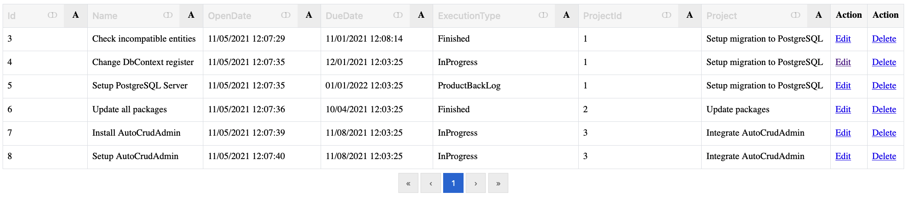

# AutoGridAdmin - Write the code that must be actually written

AutoGridAdmin is an extensible admin panel with automatic CRUD operations. All CRUD operations on DbContext entities are handled automatically for you, including:
- Validation
- Visualization
- Relationships

The following is supported out-of-the-box:
1. Grid pages with filtering/sorting for all entities declared in DbContext
   - Custom data columns can be added
   - Custom action columns ca be added
2. Create/Edit/Delete pages by primary key for all entities in the database
   - With related entities as dropdown lists
   - With enumerations as dropdown lists
3. Enforces authentication
   - Disabled by default
   - Added easily with a simple config

## How to use AutoCrudAdmin?

1. Install it from https://www.nuget.org/packages/AutoCrudAdmin/
2. Add `services.UseAutoCrudAdmin()` in `ConfigureServices`
3. Add `app.AddGenericDotNetCorAdmin()` in `Configure`
4. Run the project
5. Navigate to `{APPLICATION_URL}/{ENTITY_NAME_IN_PLURAL}`
6. You get:

 